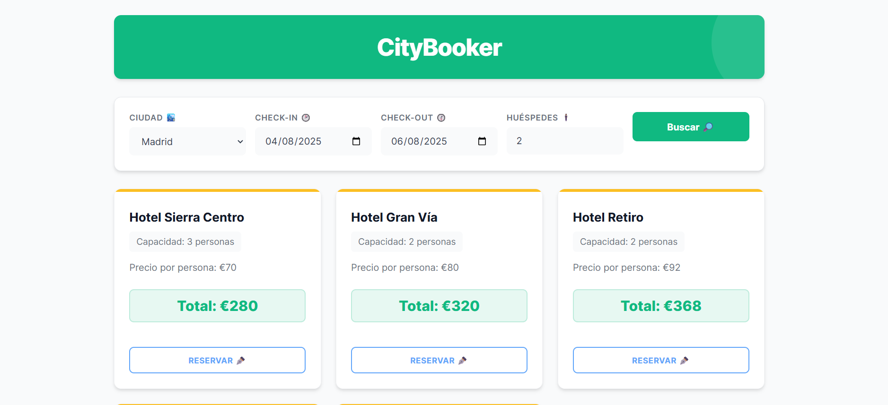
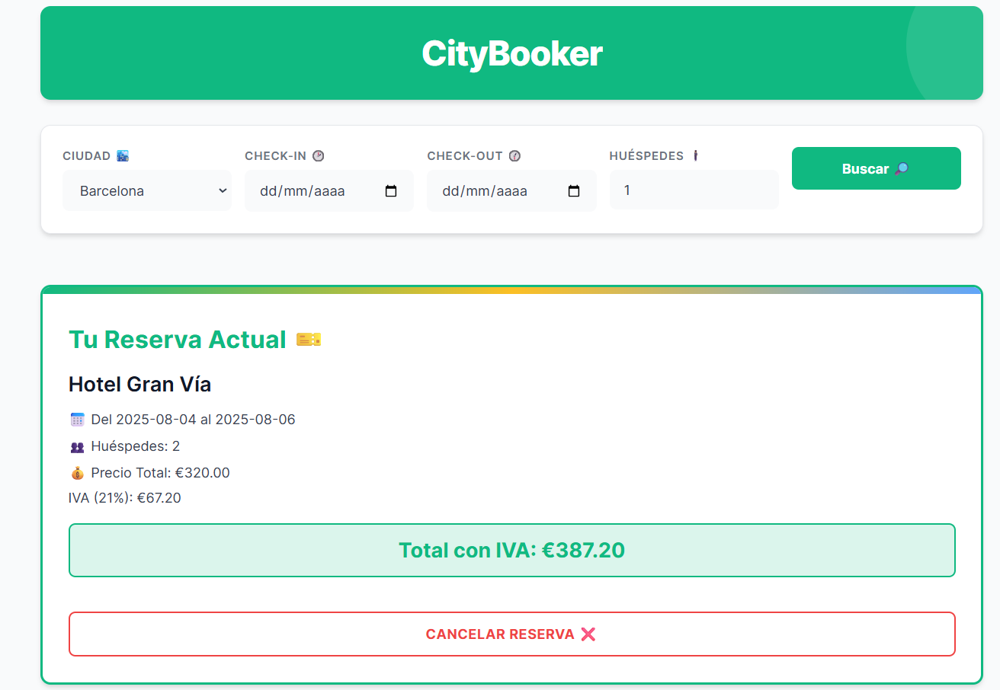

# CityBooker 🏨

Aplicación web para buscar y reservar hoteles en diferentes ciudades. Permite filtrar por fechas, número de huéspedes y muestra los precios totales calculados automáticamente con IVA incluido.

## 🚀 Características

- **Búsqueda de hoteles por ciudad** con fechas personalizadas
- **Cálculo automático de precios:**
  - Precio por persona y por noche
  - Precio total según días de estancia y número de huéspedes
  - IVA (21%) incluido en el total
- **Sistema de reservas:**
  - Crear reserva con un click
  - Visualizar reserva actual en tarjeta destacada
  - Cancelar reserva con confirmación
  - Persistencia automática en LocalStorage
- **Validación de fechas:**
  - Check-in no puede ser posterior a check-out
  - No se permiten reservas del mismo día
- **Filtrado inteligente:**
  - Solo muestra hoteles disponibles en las fechas seleccionadas
  - Verifica capacidad y disponibilidad
- **Diseño moderno y responsive:**
  - Paleta de colores profesional (verde, azul, gris claro)
  - Tarjetas de hotel con hover effects
  - Adaptable a móvil, tablet y escritorio

## 💻 Tecnologías

- **Frontend:** JavaScript (ES6), HTML5, CSS3
- **Gestión de Estado:** LocalStorage para persistencia
- **Build Tool:** Vite
- **Arquitectura:** Vanilla JS con helpers modulares

## 📁 Estructura del Proyecto

```
citybooker/
├── data/
│   └── db.json              # Base de datos de hoteles
├── src/
│   ├── helpers/
│   │   ├── crearElemento.js       # Helper para crear elementos DOM
│   │   └── localStorageManager.js # Gestión del LocalStorage
│   ├── services/
│   │   └── fetching.js            # Obtiene datos de hoteles
│   ├── App.js                     # Componente principal
│   ├── main.js                    # Punto de entrada
│   └── style.css                  # Estilos de la aplicación
├── index.html
├── .env.example
└── README.md
```

## 🛠️ Instalación

1. **Clona el repositorio:**
```bash
   git clone --no-checkout git@github.com:Amolnav/Proyectos.git
   cd Proyectos
   git sparse-checkout init --cone
   git sparse-checkout set CityBooker
   git checkout
```

2. **Instala las dependencias:**
```bash
   npm install
```

3. **Configura las variables de entorno:**
   - Copia el archivo `.env.example` y renómbralo a `.env`
   - Personaliza las keys del LocalStorage si lo deseas:
```env
   VITE_STORAGE_INPUTS="yourKeyForInputs"
   VITE_STORAGE_RESERVA="yourKeyForReserva"
```

4. **Inicia el servidor JSON (en una terminal):**
```bash
   npm run server:up
```
   El servidor se ejecutará en `http://localhost:3500`

5. **Inicia el servidor de desarrollo (en otra terminal):**
```bash
   npm run dev
```

6. **Abre tu navegador en** `http://localhost:5173`

---

**Nota:** Asegúrate de mantener ambos servidores ejecutándose simultáneamente para el correcto funcionamiento de la aplicación.

## 🎨 Uso

### Buscar Hoteles:
1. Selecciona una ciudad del desplegable
2. Elige las fechas de check-in y check-out
3. Indica el número de huéspedes
4. Haz clic en "Buscar 🔎"

### Hacer una Reserva:
1. Revisa los hoteles disponibles
2. Compara precios y capacidades
3. Haz clic en "Reservar ✒️" en el hotel deseado
4. Confirma la reserva en el alert que aparece

### Gestionar tu Reserva:
- Tu reserva actual aparecerá en una tarjeta destacada con borde verde
- Puedes cancelarla haciendo clic en "Cancelar Reserva ❌"
- La reserva persiste incluso si cierras el navegador

## 📊 Datos de Ejemplo

El archivo `db.json` incluye hoteles de ejemplo con:
- Nombre del hotel
- Ciudad
- Precio por persona por noche
- Capacidad de personas por habitación
- Disponibilidad (fechas desde/hasta)

### Formato de datos:
```json
{
  "nombre": "Hotel Example",
  "ciudad": "Barcelona",
  "precioPorPersona": 50,
  "personasPorHabitacion": 2,
  "disponibilidad": {
    "desde": "2024-01-01",
    "hasta": "2024-12-31"
  }
}
```

## 🔑 Variables de Entorno

```env
VITE_STORAGE_INPUTS="inputs"     # Key para guardar búsquedas
VITE_STORAGE_RESERVA="reserva"   # Key para guardar reserva activa
```

## 🏗️ Arquitectura y Helpers

### `crearElemento.js`
Helper para crear elementos DOM de forma concisa:
```javascript
crearElemento("div", "className", "textContent")
```

### `localStorageManager.js`
Gestión completa del LocalStorage:
- `cargar(key)` - Cargar arrays
- `cargarObjeto(key)` - Cargar objetos
- `guardar(key, item)` - Añadir a array
- `guardarTodo(key, data)` - Sobrescribir completamente
- `eliminar(key, item)` - Eliminar item de array
- `eliminarKey(key)` - Eliminar key completa

### `fetching.js`
Obtiene los datos de hoteles desde `db.json`

## 🎨 Paleta de Colores

- **Verde Principal:** `#10B981` - Botones principales y acciones
- **Azul Secundario:** `#60A5FA` - Focus states y botón de reserva
- **Gris Claro:** `#F9FAFB` - Fondo general
- **Gris Medio:** `#6B7280` - Texto secundario
- **Amarillo Acento:** `#FBBF24` - Borde decorativo en tarjetas

## 📱 Responsive Design

- **Móvil (< 768px):** Layout vertical con campos apilados
- **Tablet/Desktop (≥ 768px):** Grid horizontal de 5 columnas en formulario
- Grid adaptativo para las tarjetas de hoteles

## 🚀 Scripts Disponibles

```bash
npm run dev      # Inicia servidor de desarrollo
npm run build    # Construye para producción
npm run preview  # Vista previa de la build
npm run server:up # Inicializa el server port = 3500
```

## 📸 Capturas de Pantalla






## 👨‍💻 Autor

**Alex MN**
- GitHub: [@Amolnav](https://github.com/Amolnav)


