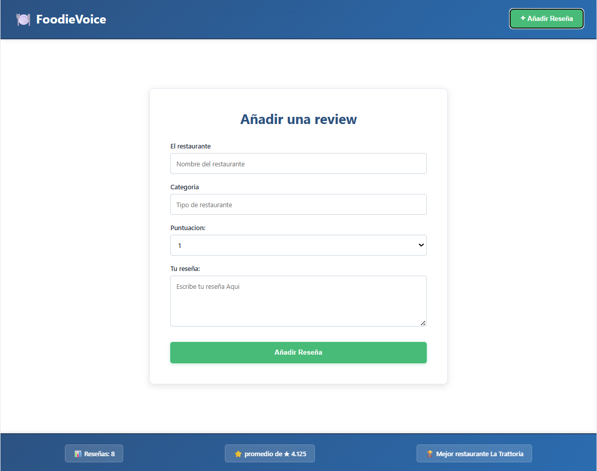

# FoodieVoice 🍽️

Aplicación web para gestionar reseñas de restaurantes. Permite añadir, filtrar, ordenar y eliminar reseñas de tus lugares favoritos, con almacenamiento local persistente.

## 🚀 Características

- ✍️ **Añadir reseñas** con nombre del restaurante, categoría, puntuación (1-5 estrellas) y comentario
- 🔍 **Sistema de filtros avanzado:**
  - Filtrar por calificación mínima (1-5 estrellas)
  - Filtrar por categorías (Italiana, Japonesa, Mexicana, etc.)
  - Combinar múltiples filtros
- 📊 **Ordenamiento flexible:**
  - Más reciente / Más antigua
  - Mejor valoración / Peor valoración
- 🗑️ **Eliminar reseñas** con confirmación
- 📈 **Estadísticas en tiempo real:**
  - Total de reseñas
  - Promedio de calificaciones
  - Mejor restaurante (basado en promedio de valoraciones)
- 💾 **Persistencia de datos** con LocalStorage
- 📱 **Diseño responsive** que se adapta a móviles y tablets
- 🎨 **Interfaz moderna** con gradientes azules y diseño limpio

## 💻 Tecnologías

- **Frontend:** JavaScript (ES6), HTML5, CSS3
- **Almacenamiento:** LocalStorage API
- **Build Tool:** Vite

## 📁 Estructura del Proyecto

```
foodievoice/
├── src/
│   ├── helpers/
│   │   ├── createElement.js           # Helper para crear elementos DOM
│   │   ├── localStorageManager.js     # Gestión del LocalStorage
│   │   └── obtenerMejorRestaurante.js # Calcula el mejor restaurante
│   ├── App.js                         # Componente principal
│   ├── main.js                        # Punto de entrada
│   └── style.css                      # Estilos de la aplicación
├── index.html
└── README.md
```

## 🛠️ Instalación

1. **Clona el repositorio:**
   ```bash
    git clone --no-checkoutgit@github.com:Amolnav/Proyectos.git
    cd Proyectos
    git sparse-checkout init --cone
    git sparse-checkout set FoodieVoice
    git checkout
   ```

2. **Instala las dependencias:**
   ```bash
   npm install
   ```

3. **Inicia el servidor de desarrollo:**
   ```bash
   npm run dev
   ```

4. **Abre tu navegador en** `http://localhost:5173`

## 🎨 Uso

### Añadir una reseña:
1. Haz clic en el botón "**+ Añadir Reseña**" en el header
2. Completa el formulario:
   - Nombre del restaurante
   - Categoría (tipo de comida)
   - Puntuación (1-5 estrellas)
   - Tu reseña (comentario)
3. Haz clic en "**Añadir Reseña**"

### Filtrar reseñas:
1. En el **sidebar izquierdo**, selecciona:
   - Calificación mínima (haciendo clic en las estrellas)
   - Categorías (marcando los checkboxes)
2. Haz clic en "**Buscar**" para aplicar los filtros

### Ordenar reseñas:
- Usa el selector "**Ordenar por:**" en la parte superior de la lista
- Opciones: Más reciente, Más antigua, Mejor valoración, Peor valoración

### Eliminar una reseña:
1. Haz clic en el botón "**🗑️ Eliminar**" en cualquier tarjeta
2. Confirma la eliminación en el diálogo

## 📊 Características Técnicas

### LocalStorage Manager
```javascript
localStorageManager()
  .cargar()              // Carga todas las reseñas
  .guardar(reseña)       // Guarda una nueva reseña
  .eliminar(id)          // Elimina una reseña por ID
```

### Estructura de una Reseña
```javascript
{
  id: 1234567890,           // Timestamp único
  restaurante: "La Trattoria",
  categoria: "Italiana",
  reseña: "Excelente pasta...",
  valoracion: "5",
  fecha: 1234567890         // Timestamp de creación
}
```

## 🎨 Paleta de Colores

- **Primario:** Azul oscuro (#2c5282, #2b6cb0)
- **Secundario:** Verde (#48bb78) para acciones positivas
- **Acento:** Azul claro (#bee3f8) para badges
- **Peligro:** Rojo (#e53e3e) para eliminar
- **Fondo:** Gris claro (#edf2f7, #f0f4f8)

## 📱 Responsive

La aplicación está optimizada para:
- 💻 **Desktop** (1024px+): Vista de dos columnas con sidebar fijo
- 📱 **Tablet** (768px-1024px): Sidebar arriba, lista abajo
- 📱 **Mobile** (<768px): Layout vertical completo

## 📸 Capturas de Pantalla




## 👨‍💻 Autor

**Alex**
- GitHub: [@amolnav](https://github.com/Amolnav)
