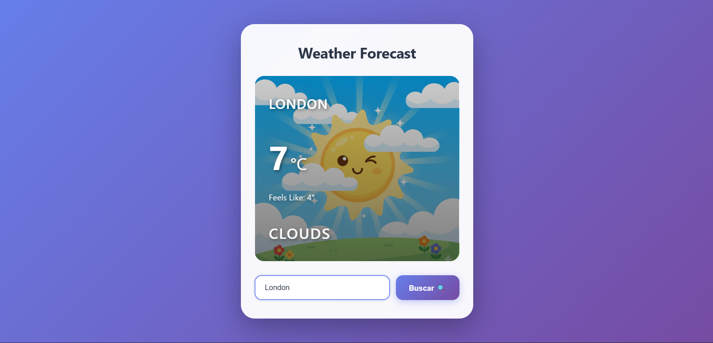
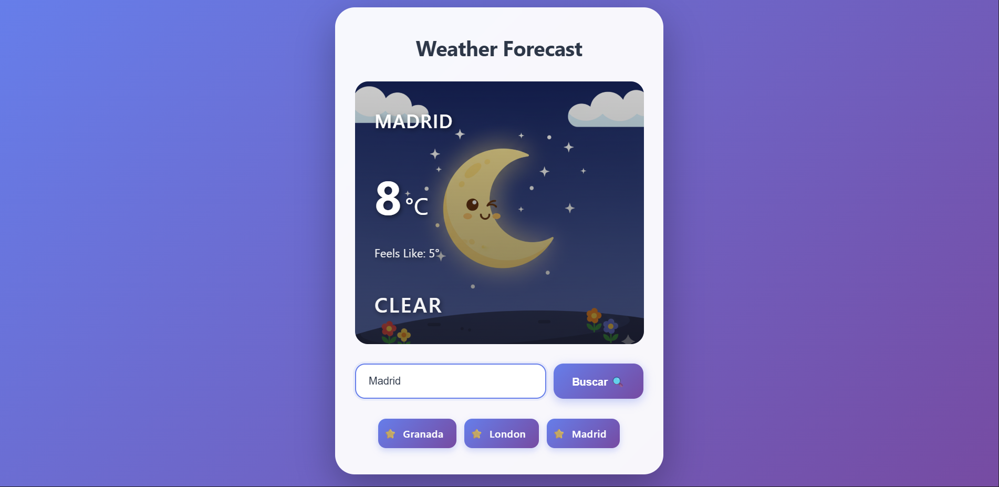

# Weather Forecast App 🌤️

Aplicación web que muestra el clima actual de cualquier ciudad usando la API de OpenWeatherMap. Actualiza temperatura, sensación térmica, estado del clima y fondo ilustrativo según las condiciones.

## 🚀 Características

- Buscar cualquier ciudad del mundo
- Mostrar información en tiempo real: ciudad, temperatura, sensación térmica y estado del clima
- Fondo dinámico con imágenes según las condiciones climáticas:
  - ☀️ Soleado
  - ☁️ Nublado
  - 🌧️ Lluvia
  - ❄️ Nieve
  - ⛈️ Tormenta
  - 💨 Viento
  - 🌡️ Temperaturas extremas
  - 🌈 Arcoíris
  - 🌙 Noche clara
- ⭐ Sistema de favoritos:
   - Añade una ciudad a favoritos haciendo doble click en la tarjeta del clima
   - Lista de ciudades favoritas visibles en la interfaz
   - Haz click en un favorito para volver a cargar su clima
   - ♻️ Persistencia automática en LocalStorage (tus favoritos se conservan incluso cerrando la app)
- Diseño responsive y moderno
- Interfaz minimalista y atractiva

## 💻 Tecnologías

- **Frontend:** JavaScript (ES6), HTML5, CSS3
- **API:** [OpenWeatherMap](https://openweathermap.org/api)
- **Build Tool:** Vite

## 📁 Estructura del Proyecto

```
weather-forecast-app/
├── public/
│   └── img/              # Imágenes según condiciones climaticas
├── src/
│   ├── helpers/
│   │   ├── calcularImagen.js  # Devuelve imagen según datos del clima
│   │   ├── localStorageManager.js  # Funciones para manejar el LocalStorage
│   │   └── fetching.js        # Obtiene datos de la API
│   ├── App.js            # Componente principal
│   ├── main.js           # Punto de entrada
│   └── style.css         # Estilos de la aplicación
├── index.html
├── .env.example
└── README.md
```

## 🛠️ Instalación

1. **Clona solo la carpeta del proyecto**
   ```bash
    git clone --no-checkout git@github.com:Amolnav/Curso_25_26_m.git
    cd Curso_25_26_m
    git sparse-checkout init --cone
    git sparse-checkout set WebClima
    git checkout
   ```

2. **Instala las dependencias:**
   ```bash
   npm install
   ```

3. **Configura tu API Key:**
   - Regístrate en [OpenWeatherMap](https://openweathermap.org/api)
   - Obtén tu API Key gratuita
   - Crea un archivo de configuración o añade tu key en `fetching.js`

4. **Inicia el servidor de desarrollo:**
   ```bash
   npm run dev
   ```

5. **Abre tu navegador en** `http://localhost:5173`

## 🎨 Uso

1. Escribe el nombre de una ciudad en el campo de búsqueda
2. Haz clic en "Buscar 🔍" o presiona Enter
3. Observa cómo se actualiza la información del clima
4. El fondo cambiará automáticamente según las condiciones meteorológicas

## 📸 Capturas de Pantalla






## 🔑 API Key

Para usar esta aplicación necesitas una API Key de OpenWeatherMap:

1. Crea una cuenta en [OpenWeatherMap](https://home.openweathermap.org/users/sign_up)
2. Ve a tu perfil → API Keys
3. Copia tu key y añádela en el tu archivo de configuracion o en el archivo `fetching.js`


## 👨‍💻 Autor

**Alex**
- GitHub: [@amolnav](https://github.com/Amolnav)

## 🙏 Agradecimientos

- [OpenWeatherMap](https://openweathermap.org/) por proporcionar la API
- Iconos e imágenes de clima generados con IA
